# AlphaZero LLM Trainer - Project Architecture

> **MCTS-guided training environment for LLMs on mathematical reasoning with adaptive depth control**

---

## 🎯 Project Overview

AlphaZero LLM Trainer is a reinforcement learning framework that trains Large Language Models using Monte Carlo Tree Search (MCTS) combined with Group Relative Policy Optimization (GRPO). The system trains a student model (Llama 3.2-3B) to solve mathematical reasoning tasks (GSM8K dataset) by exploring reasoning paths guided by teacher ensembles and dual reward signals.

### Key Features

- **MCTS-based exploration**: Structured reasoning path generation through tree search
- **Teacher ensemble**: Multiple LLMs (DeepSeek, Qwen, Llama) provide diverse reasoning guidance
- **Dual reward system**: Hard Reward Estimator (HRE) + Perplexity Reward Estimator (PRE)
- **GRPO training**: Group-based advantage normalization with KL penalty
- **Adaptive compute scaling**: Environment variables control tree depth (5-50+) based on hardware
- **Verifiers framework integration**: Built on Prime Intellect's Verifiers for RL evaluation

---

## 🏗️ System Architecture


---

## 🔄 Training Flow


---

## 🌲 MCTS Search Process

```mermaid
graph TD
    START[Start: Root Node<br/>state = empty] --> SELECT{Select Phase<br/>UCT Score}

    SELECT -->|Traverse to leaf| EXPAND[Expand Phase]

    EXPAND --> GEN_STU[Generate Student Token<br/>10 tokens, temp=0.7]
    GEN_STU --> GEN_RIGHT[Teacher: Right Branch<br/>5 continuations × 50 tokens]
    GEN_STU --> GEN_WRONG[Teacher: Wrong Branch<br/>5 continuations × 50 tokens]

    GEN_RIGHT --> SIM[Calculate Similarity<br/>Student vs Teachers]
    GEN_WRONG --> SIM

    SIM --> CHILD[Create Child Nodes<br/>Binary code: 1=right, 0=wrong]

    CHILD --> SIMULATE[Simulate Phase]
    SIMULATE --> TERM_CHECK{Terminal?<br/>Problem Solved}

    TERM_CHECK -->|Yes| CALC_HRE[Calculate HRE<br/>Correctness = 1.0 or 0.0]
    TERM_CHECK -->|No| CALC_PRE[Calculate PRE<br/>Perplexity reward only]

    CALC_HRE --> COMBINE[Combined Reward<br/>0.4×HRE + 0.6×PRE<br/>+ Length Penalty<br/>+ Direction Bonus]
    CALC_PRE --> COMBINE

    COMBINE --> BACKPROP[Backpropagate<br/>Update visits & Q-values<br/>Up to root]

    BACKPROP --> CHECK_ITER{Iterations<br/>Complete?}
    CHECK_ITER -->|No| SELECT
    CHECK_ITER -->|Yes| RETURN[Return Best Terminal Node<br/>or Highest Visit Child]

    style START fill:#e3f2fd
    style SELECT fill:#fff3e0
    style EXPAND fill:#f3e5f5
    style SIMULATE fill:#e8f5e9
    style RETURN fill:#ffebee
```



---

## 🎓 GRPO Training Pipeline

```mermaid
flowchart LR
    subgraph "Trajectory Collection"
        A[MCTS Trajectories<br/>state, next_state, reward]
    end

    subgraph "Advantage Computation"
        B[Group Trajectories]
        C[Normalize Rewards<br/>Mean & Std]
        D[Compute Advantages<br/>reward - baseline]
        E[Clip Advantages<br/>±3.0]
    end

    subgraph "Loss Computation"
        F[Student Log-Probs<br/>P_student]
        G[Reference Log-Probs<br/>P_reference]
        H[KL Divergence<br/>KL = P_student || P_reference]
        I[Policy Loss<br/>-log_probs × advantages]
        J[Total Loss<br/>policy_loss + kl_weight × KL]
    end

    subgraph "Optimization"
        K[Compute Gradients]
        L[Clip Gradients<br/>max_norm=1.0]
        M[Update Student Weights<br/>AdamW 8-bit]
    end

    subgraph "Reference Update"
        N{Steps % 50 == 0?}
        O[Deep Copy<br/>Student → Reference]
    end

    A --> B
    B --> C
    C --> D
    D --> E
    E --> I

    A --> F
    F --> H
    G --> H
    H --> J
    I --> J

    J --> K
    K --> L
    L --> M

    M --> N
    N -->|Yes| O
    N -->|No| A
    O --> A

    style A fill:#e3f2fd
    style J fill:#ffebee
    style M fill:#e8f5e9
    style O fill:#fff3e0
```

---

## 📊 Reward System Architecture

```mermaid
graph TB
    subgraph "Input"
        A[Question + Response]
    end

    subgraph "Hard Reward Estimator HRE"
        B[Terminal Checker<br/>Is complete?]
        C[Extract Answer<br/>Parse numeric value]
        D[Compare Ground Truth<br/>Match?]
        E[HRE Score<br/>1.0 if correct, 0.0 otherwise]
    end

    subgraph "Perplexity Reward Estimator PRE"
        F[Student Model<br/>Compute log-prob]
        G[Calculate Perplexity<br/>exp-log_prob/length]
        H[PRE Score<br/>-logperplexity]
        I[Accumulate PRE<br/>Discounted sum γ=0.95]
    end

    subgraph "Additional Components"
        J[Length Penalty<br/>-0.01 × depth]
        K[Direction Bonus<br/>+0.1×right - 0.05×wrong]
    end

    subgraph "Combined Reward"
        L[Weighted Sum<br/>0.4×HRE + 0.6×PRE]
        M[Add Penalties & Bonuses]
        N[Final Reward]
    end

    A --> B
    B --> C
    C --> D
    D --> E

    A --> F
    F --> G
    G --> H
    H --> I

    E --> L
    I --> L
    L --> M
    J --> M
    K --> M
    M --> N

    style E fill:#ffebee
    style I fill:#e3f2fd
    style N fill:#e8f5e9
```



---

## 🔧 Component Details

### 1. **AlphaZero Environment** (Verifiers Integration)

- Extends `verifiers.MultiTurnEnv` for multi-turn reasoning
- Adaptive depth control via `MAX_TREE_DEPTH` environment variable (5-50+)
- Multi-condition termination:
  - Depth limit reached
  - Terminal state detected
  - MCTS exhausted
  - Token budget exceeded (optional)

### 2. **MCTS System**

- **Selection**: UCT (Upper Confidence Bound for Trees) with c=√2
- **Expansion**: Binary tree (right/wrong branches) guided by similarity
- **Simulation**: Evaluate with dual reward system
- **Backpropagation**: Update Q-values and visit counts up to root

**UCT Formula:**
```
UCT = Q(node)/N(node) + c × √(ln(N(parent))/N(node))
```

### 3. **Student Model** (Llama 3.2-3B)

- 4-bit quantization (BitsAndBytes)
- LoRA adapters: r=32, α=32
- Target modules: q_proj, k_proj, v_proj, o_proj
- Gradient checkpointing for memory efficiency
- AdamW 8-bit optimizer

### 4. **Teacher Ensemble** (vLLM)

**Free Tier:**
- DeepSeek-R1-Distill-Qwen-32B
- Nemotron-Nano-9B

**Production Tier:**
- Qwen2.5-72B-Instruct
- Llama-3.3-70B-Instruct

### 5. **Reward System**

**HRE (Hard Reward Estimator) - 40% weight:**
- Binary correctness check
- Only evaluated at terminal states
- Uses answer extraction with regex

**PRE (Perplexity Reward Estimator) - 60% weight:**
- Measures response quality via student perplexity
- Accumulated with discount factor γ=0.95
- Normalized against baseline

---

## 🚀 Adaptive Compute Scaling


**Usage Examples:**
```bash
# Laptop (quick test)
MAX_TREE_DEPTH=5 python train_vllm.py --num-examples 10

# Standard workstation
MAX_TREE_DEPTH=12 python train_vllm.py --num-examples 50 --use-grpo

# H100 cluster (maximum quality)
MAX_TREE_DEPTH=50 NUM_MCTS_ITERATIONS=200 python train_vllm.py --num-examples 1000
```

---

## 📁 Project Structure

```
alphazero-llm-trainer/
│
├── environments/alphazero_llm_trainer/
│   │
│   ├── core/                          # Core algorithms
│   │   ├── environment.py             # MultiTurnEnv with adaptive depth
│   │   ├── mcts.py                    # MCTS search implementation
│   │   └── tree.py                    # TreeNode with UCT scoring
│   │
│   ├── models/                        # Model implementations
│   │   ├── student_model.py           # Llama 3.2-3B (Unsloth + LoRA)
│   │   ├── teacher_ensemble_vllm.py   # Teacher ensemble (vLLM)
│   │   └── terminal_checker_vllm.py   # Terminal state detector (vLLM)
│   │
│   ├── rewards/                       # Reward computation
│   │   ├── hre.py                     # Hard Reward Estimator
│   │   ├── pre.py                     # Perplexity Reward Estimator
│   │   ├── combined.py                # Weighted reward system
│   │   └── rubric_functions.py        # Verifiers-compatible rubrics
│   │
│   ├── config/                        # Configuration files
│   │   ├── training.yaml              # MCTS, GRPO, reward hyperparameters
│   │   ├── models.yaml                # Student/terminal checker config
│   │   └── teacher_models.yaml        # Teacher ensemble config
│   │
│   ├── utils/                         # Utilities
│   │   ├── dataset_loader.py          # GSM8K with Verifiers schema
│   │   ├── answer_extraction.py       # Parse numeric answers
│   │   └── similarity.py              # Response similarity metrics
│   │
│   ├── prompts/                       # Prompt templates
│   │   ├── token_gen.py               # Right/wrong token generation
│   │   └── terminal_check.py          # Terminal state detection
│   │
│   ├── train_vllm.py                  # Main training script
│   ├── test_gsm8k.py                  # Evaluation script
│   └── pyproject.toml                 # Package metadata
│
└── README.md                          # Full documentation
```

---

## ⚙️ Configuration Overview

### MCTS Parameters (`training.yaml`)
```yaml
mcts:
  num_iterations: 60              # Search iterations per example
  exploration_constant: 1.414     # UCT exploration (√2)
  max_tree_depth: 12              # Maximum reasoning depth
  right_tokens: 10                # Tokens per right branch
  wrong_tokens: 10                # Tokens per wrong branch
```

### GRPO Settings (`training.yaml`)
```yaml
grpo:
  enabled: true
  beta: 0.1                       # Advantage scaling
  normalize_advantages: true
  clip_advantages: 3.0            # Outlier clipping

kl_penalty:
  enabled: true
  kl_weight: 0.01                 # KL divergence weight
  update_ref_every: 50            # Reference model update frequency
```

### Reward Weights (`training.yaml`)
```yaml
rewards:
  hre_weight: 0.4                 # Hard reward weight
  pre_weight: 0.6                 # Perplexity reward weight
  pre_accumulation: true          # Enable accumulated PRE
  pre_discount_factor: 0.95       # Discount factor γ
```

---

## 📈 Performance Expectations

| Hardware | Depth | Iterations | Est. Accuracy | Time/Sample | VRAM |
|----------|-------|------------|---------------|-------------|------|
| Laptop/CPU | 5 | 30-40 | ~55-65% | 2-5 min | N/A |
| Single GPU | 12 | 60 | ~70-80% | 5-10 min | ~40-50 GB |
| A100 | 20-30 | 100-150 | ~80-90% | 10-15 min | ~60-70 GB |
| H100 Cluster | 50+ | 200+ | ~85-95% | 15-20 min | ~80-100 GB |

*Results may vary based on model selection and training configuration

---

## 🔬 Theoretical Foundation

### AlphaZero Adaptation
- **Original**: Board game tree search (Chess, Go, Shogi)
- **Adapted**: Sequential text generation with token-level actions
- **Innovation**: Binary tree (right/wrong) instead of multi-branch expansion

### MCTS for Language
- **States**: Partial text responses
- **Actions**: Token sequences (10-20 tokens per branch)
- **Rewards**: Correctness + fluency (dual reward system)
- **Policy**: Learned via GRPO from tree trajectories

### GRPO (Group Relative Policy Optimization)
- Inspired by PPO with group normalization
- Advantages normalized per trajectory group (reduces variance)
- KL penalty maintains proximity to reference policy
- Prevents distribution collapse during training

---

## 🎯 Quick Start

### Installation
```bash
cd environments/alphazero_llm_trainer
uv pip install -e .
export OPENROUTER_API_KEY="your_key_here"
```

### Training
```bash
# Standard training (default depth=12)
python train_vllm.py --num-examples 50 --use-grpo

# Adaptive depth for H100
MAX_TREE_DEPTH=50 NUM_MCTS_ITERATIONS=200 python train_vllm.py --num-examples 1000
```

### Evaluation
```bash
# Using Verifiers framework
uv run vf-eval alphazero-llm-trainer -m gpt-4o-mini -n 10

# With custom depth
MAX_TREE_DEPTH=20 uv run vf-eval alphazero-llm-trainer -m gpt-4o-mini -n 50
```

---

## 📚 Key Dependencies

- **verifiers** (≥0.1.5): RL environment framework by Prime Intellect
- **vLLM** (≥0.11.0): High-throughput LLM inference
- **unsloth** (≥2024.8): Memory-efficient LoRA fine-tuning
- **torch** (2.8.0): Deep learning framework
- **transformers**: Hugging Face model library
- **datasets**: GSM8K dataset loading

---

## 📊 Key Metrics

- **reward**: Combined weighted reward (0.4×HRE + 0.6×PRE)
- **correctness_reward**: Binary correctness from HRE (0.0 or 1.0)
- **perplexity_reward**: Trajectory quality from PRE (0.0-1.0)
- **depth**: Actual tree depth reached (0 to MAX_TREE_DEPTH)
- **terminal**: Whether problem was solved (true/false)
- **tree_size**: Number of nodes explored during MCTS

---

## 🔗 Related Work

### Core Papers
- **AlphaZero**: [Silver et al., 2017](https://arxiv.org/abs/1712.01815)
- **MCTS**: [Browne et al., 2012](https://ieeexplore.ieee.org/document/6145622)
- **PPO**: [Schulman et al., 2017](https://arxiv.org/abs/1707.06347)
- **LoRA**: [Hu et al., 2021](https://arxiv.org/abs/2106.09685)
- **GSM8K**: [Cobbe et al., 2021](https://arxiv.org/abs/2110.14168)

### Frameworks
- **Verifiers**: [Prime Intellect Verifiers](https://github.com/PrimeIntellect-ai/verifiers)
- **vLLM**: [Kwon et al., 2023](https://arxiv.org/abs/2309.06180)
- **Unsloth**: [Unsloth AI](https://github.com/unslothai/unsloth)

---

## 📝 Citation

```bibtex
@software{alphazero_llm_trainer,
  title = {AlphaZero LLM Trainer: MCTS-based RL for Language Model Training},
  author = {Pradheep, Vidhya Prakash},
  year = {2025},
  url = {https://github.com/Mantissagithub/alphazero-llm-trainer},
  note = {Integrated with Prime Intellect Verifiers Framework}
}
```

---

**License**: See component licenses (Apache 2.0, BSD-style)
**Author**: Pradheep Vidhya Prakash
**Organization**: Prime Intellect
**Repository**: [github.com/Mantissagithub/alphazero-llm-trainer](https://github.com/Mantissagithub/alphazero-llm-trainer)

