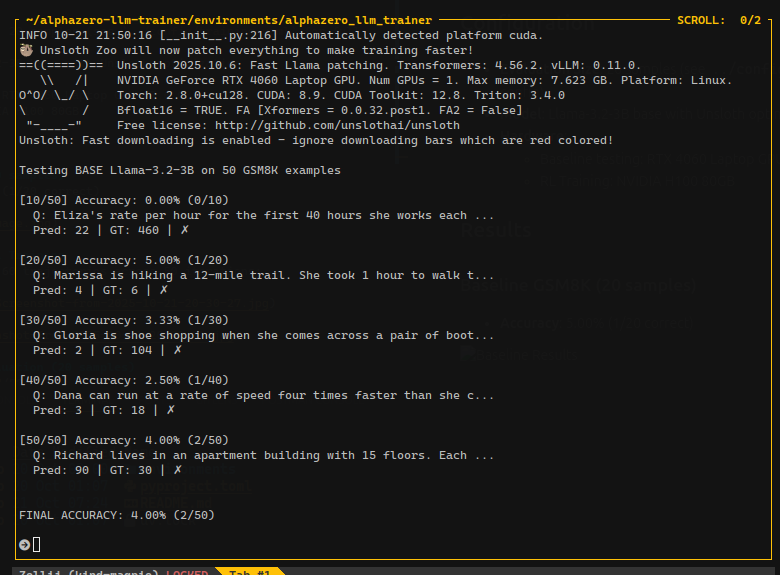

# Training Results

I accidentally stopped the instance before pushing the results from the instance SSH login, so adding the screenshots here. Will update the readme once I have access to the instance again, or I will run again and update the readme.

## Configuration

- **Evaluation Size**: 50 samples (see `../config/training.yaml` for full config)
- **Model**: Llama-3.2-3B base with Unsloth optimization
- **Hardware**:
  - Baseline testing: RTX 4060 Laptop GPU (7.6 GB)
  - RL Training: NVIDIA H100 80GB

## Results

### Baseline GSM8K (20 samples)
- **Accuracy**: 4.00% (2/50 correct)

### AlphaZero-style RL Training
Training with GRPO on 60 trajectories across 50 iterations:

### Post-Training Evaluation (50 samples)
- **Total Correct**: 4/50
- **Final Accuracy**: 8.00%
- **Average Reward**: 0.663

## Summary

The model improved from 4% to 8% accuracy on GSM8K using AlphaZero-style GRPO training with MCTS trajectory generation. Still needs significant improvement to be competitive, but shows promise for further tuning and scaling.
